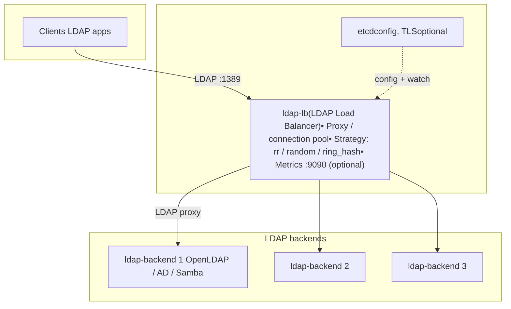

# LDAP Load Balancer — Administrator's Guide

This guide is for infrastructure administrators (system administrators, DevOps) who deploy and operate the LDAP Load Balancer in production or test environments.

---

## 1. Introduction

### Architecture (schematic)



- **ldap-lb**: Single entry point for clients; accepts LDAP on the listen port (e.g. 1389), optionally serves Prometheus metrics on 9090.
- **etcd**: Optional; when used, ldap-lb loads and watches configuration (and optionally TLS material) from etcd for live reload without restart.
- **ldap-backend 1..3**: LDAP servers (OpenLDAP, AD, Samba, etc.); the balancer chooses one per connection and forwards traffic.

### Purpose

LDAP Load Balancer is an LDAP v3 proxy that distributes client requests across multiple LDAP backend servers. It provides connection pooling to backends, configurable balancing strategies, optional TLS, and Prometheus metrics.

### Typical scenarios

- **Multiple LDAP backends**: Several OpenLDAP, 389-DS, or other LDAP servers behind a single endpoint.
- **Active Directory / Samba AD**: Load balancing across domain controllers (DCs); clients connect to the balancer hostname, which proxies to DCs.
- **Mixed environments**: Backends can be AD, Samba, or OpenLDAP; the balancer does not need to speak a specific directory dialect—it forwards LDAP messages.

### What the balancer does

- **Proxy**: Forwards LDAP traffic (bytes) between clients and one backend per connection. In this mode it does not parse or modify bind credentials; SASL (GSSAPI, NTLM) and Simple Bind pass through.
- **Connection pooling**: Maintains pools of connections to each backend (`numconns`, `bindconns`); reuses them for multiple client requests.
- **Backend selection**: Chooses a backend per connection using a strategy: `random`, `round_robin`, or `ring_hash` (consistent hashing by client key, e.g. IP).
- **Health checks**: Optional periodic checks (whoami, bind, or TCP) to mark backends up/down; state is exposed in metrics.

### GSSAPI/Kerberos and keytab

**A keytab on the balancer is not required.** The client obtains a ticket to the name the client connects to (e.g. `ldap/ldap-balancer.example.com`). The balancer only proxies the LDAP stream; the **backend** (e.g. AD or Samba DC) validates the ticket. For that to succeed, the backend must have the SPN of the balancer registered on its account. See [Section 6](#6-gssapikerberos-through-the-balancer).

---

## 2. Requirements and Installation

### Requirements

- **OS**: Linux (or any platform supported by Rust); no specific distribution is required.
- **Network**: Access to backend LDAP servers and, if used, etcd and Prometheus.
- **Build**: Rust toolchain (`cargo`) for building from source.

### Build from source

```bash
git clone <repository-url>
cd ldap_load_balancer

cargo build --release
```

The binary is produced at `target/release/ldap-load-balancer`.

### Run the binary

```bash
./target/release/ldap-load-balancer --config config.yaml
```

Or with configuration from etcd (see [Section 3](#3-configuration)):

```bash
./target/release/ldap-load-balancer --etcd-endpoints http://127.0.0.1:2379 --etcd-config-key /ldap-load-balancer/config --etcd-fallback-file config.yaml
```

### Docker

The project provides a Dockerfile in the repository root. Build and run with Docker Compose:

```bash
docker compose up -d
```

- **Balancer image**: Built from the repo (`.`) by Docker Compose.
- **Ports**: 
  - **1389** — LDAP (client connections).
  - **9090** — HTTP metrics (GET /metrics, /health, /ready).

Example: run only the balancer (after building) with a config file:

```bash
docker compose up -d ldap-load-balancer
```

Configuration for the Docker setup is in `config.docker.yaml`; the Compose file mounts it as `/etc/ldap-lb/config.yaml` and can use etcd for live reload (see [Section 3](#3-configuration)).

---

## 3. Configuration

Configuration is YAML. A full example is in **`config.example.yaml`**. Main sections:

- `listen` — where the balancer accepts client connections.
- `backend` — how to reach and balance across LDAP servers.
- `tls` — optional TLS for the listener (LDAPS).
- `metrics_listen` — optional HTTP server for Prometheus and health.
- `proxyauthz`, `io_threads` — optional top-level options.

Config can be loaded from a file (`--config`) or from **etcd** with live reload (`--etcd-endpoints`, `--etcd-config-key`, optional `--etcd-fallback-file`). When using etcd, backend list, TLS paths, and other backend-related settings are reloaded on key change without restart; `listen.url` is fixed at startup (unless overridden by `--listen`).

### 3.1 `listen`

| Parameter | Description | Example |
|-----------|-------------|---------|
| `url` | Listen address. Format: `ldap://host:port` or `ldaps://host:port`. Use `:1389` to bind all interfaces on port 1389. | `"ldap://:1389"`, `"ldaps://0.0.0.0:636"` |

For `ldaps://`, the `tls` section must be set (certificate and key). In the current version, TLS on the listener is supported when `listen.url` uses `ldaps://` and `tls` is configured; see [docs/TODO.md](TODO.md) for limitations (e.g. StartTLS on the listener).

### 3.2 `backend`

Global backend options:

| Parameter | Description | Default / values |
|-----------|-------------|-------------------|
| `strategy` | Load balance strategy: `random`, `round_robin`, `ring_hash`. | `random` |
| `sticky_writes` | If true, write operations (Add/Modify/Delete/ModifyDN) after Bind use the same backend as the Bind. In proxy mode one connection per client already gives this; the option documents intent. | `true` |
| `ring_hash_vnodes` | For `ring_hash`, number of virtual nodes per server. | `100` |
| `health_check_interval_sec` | Interval in seconds for backend health checks. `0` disables (metrics show backend state as unknown). | `10` |
| `health_check_timeout_sec` | Timeout in seconds for each health check. | `3` |
| `health_check` | Type: `whoami` (default), `bind` (simple bind with backend credentials), or `tcp` (connect only). | `whoami` |
| `connect_attempts` | Number of connection attempts to a backend in proxy mode before trying another. | `3` |
| `connect_retry_delay_ms` | Delay in ms between attempts. | `50` |
| `tls_skip_verify` | If true, do not verify server certificates for `ldaps://` backends (test/internal use only). | `false` |
| `tls_ca_etcd_key` | etcd key containing PEM CA (or CA bundle) for verifying `ldaps://` backends. Used when config is from etcd. | — |
| `bind` | Credentials and TLS for connections to backends (see below). | — |
| `servers` | List of backend servers (see below). | — |

#### `backend.bind`

Used for pool connections to backends (e.g. whoami health check, or bind-based health).

| Parameter | Description | Example |
|-----------|-------------|---------|
| `method` | Bind method, e.g. `simple`. | `"simple"` |
| `binddn` | DN for bind. | `"cn=admin,dc=example,dc=com"` |
| `credentials` | Password. Prefer storing in etcd or secrets manager; avoid plain text in config. | — |
| `network_timeout` | Timeout in seconds for bind. | `5` |
| `tls_cacert` | Path to CA for backend TLS (file). | `"/path/to/ca.crt"` |
| `tls_cert`, `tls_key` | Client cert/key for backend TLS (file). | Optional |

For `ldaps://` backends, CA can also be supplied via `backend.tls_ca_etcd_key` (etcd key with PEM).

#### `backend.servers`

Each entry:

| Parameter | Description | Default / example |
|-----------|-------------|--------------------|
| `uri` | Backend URI: `ldap://host:port` or `ldaps://host:port`. | `"ldap://ldap1:389"` |
| `starttls` | For `ldap://`: use StartTLS; e.g. `critical` to require it. | Optional |
| `retry` | Retry count or delay (implementation-dependent; see config.example.yaml). | e.g. `5` or `5000` |
| `max_pending_ops` | Max pending operations per connection. | e.g. `50` |
| `conn_max_pending` | Max pending per connection. | e.g. `10` |
| `numconns` | Pool size (total connections to this backend). | e.g. `10` |
| `bindconns` | Number of pre-bound connections in the pool. | e.g. `5` |

### 3.3 `tls` (listener)

Used when `listen.url` is `ldaps://` or when TLS is required for the listener.

| Parameter | Description | Example |
|-----------|-------------|---------|
| `cert_file` | Path to server certificate (PEM). | `"/path/to/cert.pem"` |
| `key_file` | Path to private key (PEM). | `"/path/to/key.pem"` |
| `ca_file` | Optional path to CA (PEM). | `"/path/to/ca.pem"` |
| `cert_etcd_key`, `key_etcd_key` | etcd keys whose values are PEM cert and key (when config is from etcd). | `"/ldap-load-balancer/tls/cert.pem"` |
| `ca_etcd_key` | Optional etcd key for CA PEM. | — |
| `share_slapd_ctx` | Reserved / legacy. | — |

If `cert_etcd_key` and `key_etcd_key` are set, TLS material is loaded from etcd and can be updated (hot reload).

### 3.4 `metrics_listen`

HTTP listen address for the metrics and health server.

| Parameter | Description | Example |
|-----------|-------------|---------|
| `metrics_listen` | TCP address. | `"0.0.0.0:9090"` |

When set, the balancer exposes:

- **GET /metrics** — Prometheus text format.
- **GET /health** — liveness (process alive).
- **GET /ready** — readiness (at least one backend healthy); returns 503 otherwise.

### 3.5 `proxyauthz`

| Parameter | Description | Default |
|-----------|-------------|---------|
| `proxyauthz` | Proxy Authorization (RFC 4370): balancer would add proxy identity to requests. **Read from config but not implemented** in the current proxy-only mode; see [docs/TODO.md](TODO.md). | `false` |

### 3.6 Configuration via etcd (live reload)

- **`--etcd-endpoints`**: Comma-separated list of etcd endpoints (e.g. `http://127.0.0.1:2379`). When set, config is read from etcd and watched; changes are applied without restart.
- **`--etcd-config-key`**: etcd key holding the YAML config (default: `/ldap-load-balancer/config`).
- **`--etcd-fallback-file`**: If the key is empty or etcd is unavailable at startup, load this file.

Example:

```bash
./target/release/ldap-load-balancer \
  --etcd-endpoints http://127.0.0.1:2379 \
  --etcd-config-key /ldap-load-balancer/config \
  --etcd-fallback-file config.yaml
```

Write config into etcd (example):

```bash
etcdctl put /ldap-load-balancer/config "$(cat config.yaml)"
```

**Certificates and CA in etcd**: Values are UTF-8 strings. Store PEM as-is (including `-----BEGIN ...-----` / `-----END ...-----`). A CA bundle is one key with multiple PEM blocks concatenated. In YAML you reference **etcd keys**, not file paths:

- Listener TLS: `tls.cert_etcd_key`, `tls.key_etcd_key`, optionally `tls.ca_etcd_key`.
- Backend CA for `ldaps://`: `backend.tls_ca_etcd_key`.

Example:

```yaml
tls:
  cert_etcd_key: "/ldap-load-balancer/tls/cert.pem"
  key_etcd_key: "/ldap-load-balancer/tls/key.pem"
  ca_etcd_key: "/ldap-load-balancer/tls/ca-bundle.pem"

backend:
  tls_ca_etcd_key: "/ldap-load-balancer/backend-tls/ca-bundle.pem"
  # ...
```

---

## 4. Balancing Strategies and Scenarios

### When to use each strategy

- **`random`**: Good for stateless backends (e.g. read-only replicas). Simple, no affinity.
- **`round_robin`**: Even rotation; useful when backends are similar and you want uniform distribution.
- **`ring_hash`**: Same client (e.g. same IP) is always mapped to the same backend. Use when:
  - You have multiple DCs and replication; you want a client to stick to one DC so that writes and reads are consistent.
  - You need client affinity for caches or session-like behavior.

In **proxy mode**, one client connection is handled by one backend connection for the lifetime of that connection, so “sticky” behavior is natural per connection. `ring_hash` adds sticky-by-client (e.g. by IP) when you have many short-lived connections from the same client.

### Sticky writes

With `sticky_writes: true` (default), after a Bind, write operations (Add/Modify/Delete/ModifyDN) are sent to the same backend that served the Bind. In proxy mode this is already the case because one client connection uses one backend connection. The option is for clarity and future handler modes.

### Multiple DCs and replication

With several DCs behind the balancer, replication can lag. If a client binds on DC1 and a subsequent write is sent to DC2 before replication, the operation can fail. Using **`ring_hash`** (and optionally the same `sticky_writes`) keeps a given client on the same DC. For GSSAPI, you must register the balancer’s SPN on **each** DC (see [Section 6](#6-gssapikerberos-through-the-balancer)).

---

## 5. TLS and Security

### Backend connections

- **`ldap://` + StartTLS**: Use `starttls: "critical"` (or equivalent) so the connection is upgraded to TLS; backend certificate can be verified if CA is configured.
- **`ldaps://`**: TLS from the first byte. Certificate verification uses the system CA store or:
  - **`backend.tls_ca_etcd_key`**: etcd key with PEM CA or bundle.
  - **`backend.tls_skip_verify: true`**: Disables verification (test/internal only; not recommended for production).

### Listener (client-facing)

- **`listen.url: ldaps://:636`** and a **`tls`** section (cert and key, from files or etcd) enable TLS on the listener. The balancer accepts TLS and then proxies LDAP.
- **Current limitation**: StartTLS on the listener (client connects to `ldap://` and upgrades) is not implemented; see [docs/TODO.md](TODO.md).

### LDAPS in Docker

To run the balancer in LDAPS-only mode (port 636, TLS from the first byte):

1. **Config**: Use a config file with `listen.url: "ldaps://:636"` and a `tls` section. Example: `config.docker.ldaps.yaml` in the repo root.
2. **Certificates**: Either from **files** (mount cert dir, set `tls.cert_file` / `tls.key_file`) or from **etcd** (set `tls.cert_etcd_key` / `tls.key_etcd_key` in config, upload PEM to those etcd keys; supports hot reload).
   - **Quick start (files)**: The compose service `ldap-load-balancer-ldaps` mounts `./docker/ldap1/certs` as `/etc/ldap-lb/certs`; config uses `tls.cert_file` and `tls.key_file` (e.g. `ldap1.crt`, `ldap1.key`).
   - **Dedicated certs (files)**: Run `./docker/ldap-lb/certs/gen-certs.sh` (requires ldap1 CA). This creates `cert.pem` and `key.pem` in `docker/ldap-lb/certs/` with SAN for `ldap-load-balancer`, `ldap-lb`, `localhost`. Then set `tls.cert_file` / `tls.key_file` and mount `./docker/ldap-lb/certs:/etc/ldap-lb/certs:ro`.
   - **From etcd**: Use config `config.docker.ldaps.etcd.yaml` (or set in your config `tls.cert_etcd_key: "/ldap-load-balancer/ldaps-tls/cert.pem"`, `tls.key_etcd_key: "/ldap-load-balancer/ldaps-tls/key.pem"`). Put the full config in etcd key `/ldap-load-balancer/ldaps-config`, then put cert and key PEM into the etcd keys above. No cert volume needed; certs can be updated without restart.
3. **Start**: `docker compose up -d ldap-load-balancer-ldaps` (ensure etcd and backends are up).
4. **Verify**: From host, `ldapsearch -x -H ldaps://localhost:636 -b "dc=example,dc=com" -D "cn=admin,dc=example,dc=com" -w secret` (for self-signed certs you may need to set `LDAPTLS_REQCERT=never` or equivalent).

In production, use certificates from a trusted CA or internal PKI; self-signed certs are for test environments only.

### Recommendations

- Do not store passwords in plain text in config files; use etcd, a secrets manager, or environment-based injection.
- Prefer etcd (or similar) for TLS certs and CA; use minimal etcd permissions.
- Run the balancer with minimal privileges; avoid root where possible.
- In production, use TLS for client connections (ldaps:// or a reverse proxy that terminates TLS) and for backend connections where supported.

---

## 6. GSSAPI/Kerberos Through the Balancer

### Why the client gets a ticket for the balancer

Clients connect to the balancer’s hostname (e.g. `ldap-balancer.example.com`). They request a ticket for `ldap/ldap-balancer.example.com`. The balancer does not authenticate the ticket; it forwards the LDAP stream to a backend. The **backend** (AD or Samba DC) validates the ticket and expects the SPN in the ticket to be registered on the account that runs the LDAP service.

### Why the backend may return 49 (Invalid credentials)

If the backend only has `ldap/dc01.example.com` registered and the client presents a ticket for `ldap/ldap-balancer.example.com`, the backend rejects the bind (e.g. LDAP 49). So the backend must also accept the SPN of the balancer.

### Solution: register the balancer’s SPN on the backend

Register on the **backend** (DC) the SPN that the client uses: `ldap/<balancer-hostname-or-fqdn>`. No keytab is needed on the balancer; the keytab stays on the DC. The repository provides scripts and docs for this:

- **Full guide**: [docs/spn-registration/README.md](spn-registration/README.md).

**Active Directory**: Use the PowerShell script `register-spn-ad.ps1` with the balancer hostname/FQDN; it registers the SPN on the computer account of the PDC (or a specified DC). Example:

```powershell
.\register-spn-ad.ps1 -BalancerHost ldap-balancer.example.com
.\register-spn-ad.ps1 -BalancerHost ldap-balancer.example.com -AccountName DC01$
```

**Samba AD**: Use `register-spn-samba.sh` on the Samba DC. Example:

```bash
./register-spn-samba.sh ldap-balancer.example.com
./register-spn-samba.sh ldap-balancer.example.com DC01$
```

### Multiple backends (several DCs)

If the balancer fronts several DCs, the client can hit any of them. Register the balancer’s SPN (`ldap/<balancer-fqdn>`) on **each** DC’s account (each DC’s computer account or the account that runs LDAP). Run the script once per DC (or register manually on each).

---

## 7. Monitoring and Metrics

### Enabling Prometheus

Set `metrics_listen` in the config (e.g. `"0.0.0.0:9090"`). The balancer then serves:

- **GET /metrics** — Prometheus exposition format.

### Metrics (RED and backend state)

| Metric | Type | Description |
|--------|------|-------------|
| `ldap_lb_connections_total` | counter | Total client connections accepted. |
| `ldap_lb_requests_total{op="bind\|search\|add\|modify\|delete\|extended"}` | counter | Successful requests by operation (Rate). |
| `ldap_lb_errors_total{op="..."}` | counter | Errors by operation (Errors). |
| `ldap_lb_request_duration_seconds` | histogram | Request duration by operation (Duration); `_bucket`, `_sum`, `_count`. |
| `ldap_lb_backend_servers` | gauge | Number of configured backend servers. |
| `ldap_lb_backend_up{uri="..."}` | gauge | Backend state: 1 = up, 0 = down, -1 = unknown (health check disabled). |
| `ldap_lb_backend_requests_total{uri="...", op="..."}` | counter | Requests forwarded to each backend by operation (proxy mode). |

### Example scrape

```bash
curl http://localhost:9090/metrics
```

### Integration with Prometheus and Grafana

The repository includes example Docker Compose services:

- **Prometheus**: `docker/prometheus/prometheus.yml` scrapes the balancer at `ldap-load-balancer:9090`, path `/metrics`.
- **Grafana**: `docker/grafana/provisioning/` defines a Prometheus datasource and a dashboard (`ldap-lb.json`) with panels for connections, backend count, request rate, error rate, and backend health.

When using the Compose stack, start Prometheus and Grafana; the dashboard will show RED-style metrics and backend status.

---

## 8. Production Deployment

### Recommendations

- **Process management**: Run under systemd (or similar). Example with config file:

  ```bash
  /path/to/ldap-load-balancer --config /etc/ldap-load-balancer/config.yaml
  ```

  With etcd and fallback:

  ```bash
  /path/to/ldap-load-balancer --etcd-endpoints http://etcd-host:2379 --etcd-config-key /ldap-load-balancer/config --etcd-fallback-file /etc/ldap-load-balancer/config.yaml
  ```

- **Ports**: Open 1389 (LDAP) and, if used, 9090 (metrics/health).
- **Health checks**: Use **GET /health** for liveness and **GET /ready** for readiness (e.g. Kubernetes, Docker healthcheck). Example:

  ```bash
  curl -f http://localhost:9090/ready
  ```

- **Backends**: Use at least two backends for availability; align strategy with replication (e.g. `ring_hash` for multiple DCs).
- **GSSAPI**: Register the balancer’s SPN on every DC that can be selected (see [Section 6](#6-gssapikerberos-through-the-balancer)).
- **Secrets**: Prefer etcd or a secrets manager for credentials and certificates; restrict access to config and etcd keys.

### Current limitations (see TODO)

- **Graceful shutdown**: SIGTERM/SIGINT are not fully handled; connections may be dropped on stop. See [docs/TODO.md](TODO.md).
- **TLS on listener**: Supported for `ldaps://` with `tls` section; StartTLS on the listener is not implemented. See [docs/TODO.md](TODO.md).
- **Health endpoint**: **GET /health** and **GET /ready** are implemented on the same HTTP server as **GET /metrics** (when `metrics_listen` is set). See [docs/TODO.md](TODO.md) for any future changes.

---

## 9. Verification and Troubleshooting

### Basic checks

**LDAP search** (replace host, port, bind DN, password, base):

```bash
ldapsearch -x -H ldap://localhost:1389 -b "dc=example,dc=com" -D "cn=admin,dc=example,dc=com" -w secret
```

**WhoAmI**:

```bash
ldapwhoami -x -H ldap://localhost:1389 -D "cn=admin,dc=example,dc=com" -w secret
```

From the Docker client container (Compose):

```bash
docker compose exec ldap-client ldapsearch -x -H ldap://ldap-load-balancer:1389 -b "dc=example,dc=com" -D "cn=admin,dc=example,dc=com" -w secret
```

### Logs

- Use `--debug` for verbose logging. Check for:
  - Connection and bind errors to backends.
  - TLS handshake failures (client or backend).
  - Health check failures (backend marked down).

### Typical issues

| Symptom | Possible cause | Action |
|---------|----------------|--------|
| **Invalid credentials (49)** with GSSAPI | SPN mismatch: client ticket is for balancer, backend has no such SPN. | Register `ldap/<balancer-fqdn>` on each backend DC; see [docs/spn-registration/README.md](spn-registration/README.md). |
| Backend unreachable | Backend down, network, or wrong URI. | Check `backend_up` in metrics; verify URIs and firewall; check health check type and timeouts. |
| High errors or timeouts | Backend overload, network latency, or pool too small. | Tune `numconns`/`bindconns`, `network_timeout`, health check interval; monitor `ldap_lb_request_duration_seconds` and `ldap_lb_errors_total`. |

---

## 10. CLI Reference

| Option | Short | Description |
|--------|-------|-------------|
| `--config` | `-c` | Path to YAML config file. Required unless etcd is used. |
| `--etcd-endpoints` | — | Comma-separated etcd endpoints (e.g. `http://127.0.0.1:2379`). Enables config from etcd with live reload. |
| `--etcd-config-key` | — | etcd key for YAML config. Default: `/ldap-load-balancer/config`. |
| `--etcd-fallback-file` | — | Config file used when etcd key is empty or etcd is unavailable at startup. |
| `--etcd-endpoints-local` | — | Use `http://127.0.0.1:12379` as etcd (e.g. when running on host with Docker publishing 12379). |
| `--listen` | `-l` | Override listen URL (e.g. `ldap://:1389`). |
| `--debug` | `-d` | Enable debug logging. |

Either `--config` or `--etcd-endpoints` must be provided.

---

*For development, architecture, and open items (graceful shutdown, StartTLS, proxyauthz, etc.), see [docs/TODO.md](TODO.md).*
